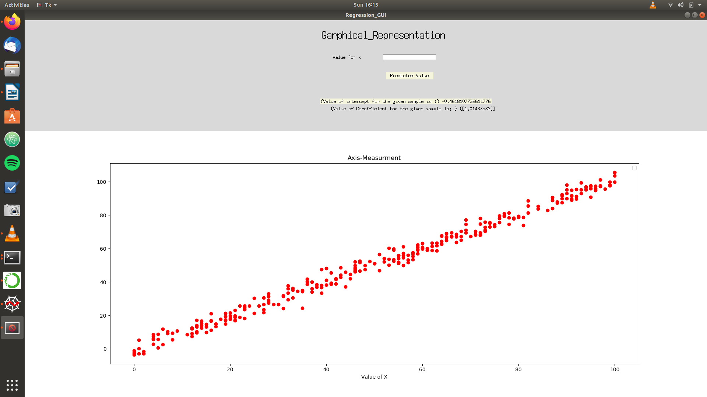

# Linear_Regression_GUI
A Simple GUI application to predict the linear relationship in the given Sample data

# Prerequiste
Python3
# Interface 

# About
This is linear Regression algorithm which helps in predicting the value of a dependent varibale by using the relationship given in the
sample data.
It also uses Tkinter to create an "Python GUI Script" to accept the data from the user and predict the values with the help of the Linear_regression_Algorithm

User can also use multivariable parameters to predict the value.

This model has been tested to predict the Weather condition for a sample data that uses various parameters.
